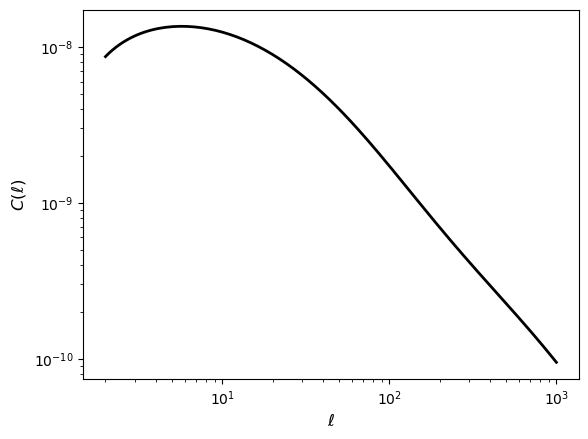

.. _quickstart:

**********
Quickstart
**********

Once CCL is installed and you have grasped its basic concepts, you can take it
for a spin!

.. code-block:: python

    import numpy as np
    import matplotlib.pyplot as plt

    import pyccl as ccl

    # Create new Cosmology object with a given set of parameters.
    cosmo = ccl.Cosmology(
        Omega_c=0.27, Omega_b=0.045, h=0.67, sigma8=0.8, n_s=0.96,
        transfer_function='bbks')

    # Define a binned galaxy number density curve as a function of redshift.
    z_n = np.linspace(0, 1, 500)
    n = np.ones(z_n.shape)

    # Create objects to represent tracers of the weak lensing signal with this
    # number density and no intrinsic alignments.
    lens1 = ccl.WeakLensingTracer(cosmo, dndz=(z_n, n))
    lens2 = ccl.WeakLensingTracer(cosmo, dndz=(z_n, n))

    # Compute the angular cross-spectrum of the two tracers.
    ell = np.geomspace(2, 1000, 128)
    cell = cosmo.angular_cl(lens1, lens2, ell)

    plt.loglog(ell, cell, "k-", lw=2)
    plt.xlabel("$\ell$", fontsize=12)
    plt.ylabel("$C(\ell)$", fontsize=12)

