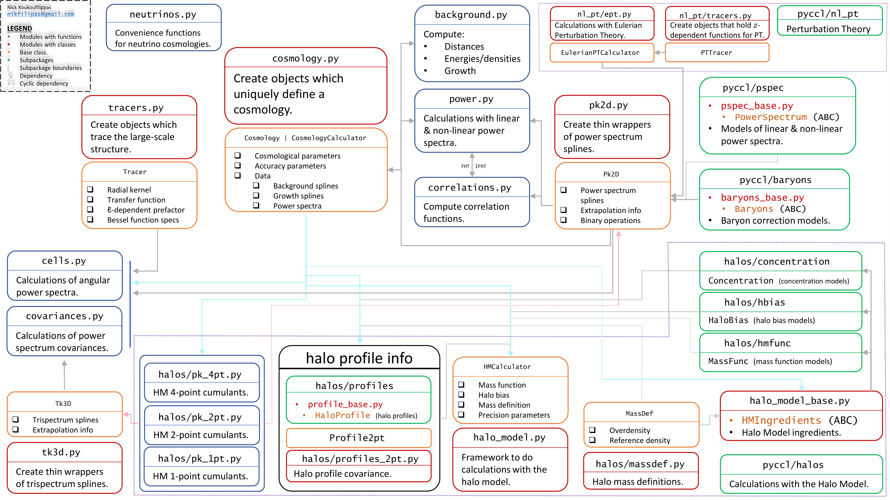

*************
Core Concepts
*************

Notation & Conventions
======================
CCL is structured around :class:`~pyccl.cosmology.Cosmology` objects which hold
the cosmologicalparameters and any tabulated data associated with a given
cosmology. The library then provides functions to compute specific quantities
of interest. See the full API documentation through the :mod:`pyccl` package
and subpackages/submodules for more details.

CCL follows these conventions:
  - units are not h-inverse, :math:`h^{-1}` (i.e., :math:`\rm Mpc` instead of
    :math:`{\rm Mpc}/h`, and :math:`\rm M_\odot` instead of
    :math:`{\rm M_\odot} / h`),
  - scale factor :math:`a` is the time coordinate (instead of redshift
    :math:`z`),
  - functions that take `cosmo` as their first argument are also methods of
    :class:`~pyccl.cosmology.Cosmology`.

See :class:`~pyccl.cosmology.Cosmology` for more details on the supported
models for various cosmological quantities (e.g. the power spectrum) and the
specification of the cosmological parameters.

Numerical Accuracy
==================
The internal splines and integration accuracy are controlled by the global
instances ``pyccl.spline_params`` and ``pyccl.gsl_params``.
See :class:`~pyccl.base.parameters.spline_params.SplineParams` and
:class:`~pyccl.base.parameters.gsl_params.GSLParams` for a description of the
accuracy parameters. To reset the accuracy parameters to their default values,
call :meth:`~pyccl.base.parameters.parameters_base.Parameters.reload`.

Instances of :class:`~pyccl.cosmology.Cosmology` hold a copy of the global
accuracy parameters at the time of instantiation. These are used by most
functions accepting `cosmo`, to determine the precision level of the
computation.

A comprehensive set of examples showcasing the different types of functionality
implemented in CCL can be found in https://github.com/LSSTDESC/CCLX.

Package Structure
=================
CCL is written in ``C`` and ``Python``, but only the Python code is public API.
Below is a chart that outlines the structure of the different objects, as well
as their internal dependencies.

:download:`download full-size image <_static/organogram.png>`

The core functionality of the package is hidden from the organogram above. It
lives in :mod:`~pyccl.base` and controls the behavior of all base classes
(mainly enforcing immutability and ensuring consistency of objects).
